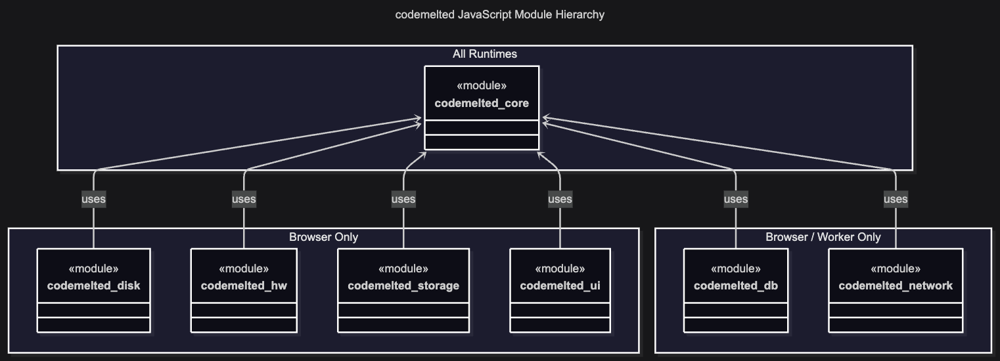

<center>
  <br /><br />
</center>

Welcome to the *codemelted JavaScript modules*. These represent seven ES6 modules wrapping the Web APIs providing easy to utilize APIs to build web based applications. These include Single Page Applications (SPAs) / Progressive Web Applications (PWAs), general website development, and the development of desktop / mobile applications utilizing Rust TAURI crate. It also provides proper JSDoc bindings so you can utilize both JavaScript / TypeScript for your project. Finally, care was taken to utilize the core module of these modules within your preferred V8 (Bun, Deno, Node) runtime for backend cloud / server side development.

<center>
  <br />
  <a href="https://www.buymeacoffee.com/codemelted" target="_blank">
    
  </a>
  <br /><br />
  <p>If you find this module useful, any support is greatly appreciated. Thank you! 🙇</p>
</center>

**Table of Contents**

- [FEATURES](#features)
  - [Domain Use Cases](#domain-use-cases)
  - [Project Build Process](#project-build-process)
- [GETTING STARTED](#getting-started)
  - [Module Hierarchy](#module-hierarchy)
  - [Rust TAURI Development](#rust-tauri-development)
  - [V8 Runtime Utilization](#v8-runtime-utilization)
- [USAGE](#usage)
- [LICENSE](#license)

# FEATURES

## Domain Use Cases

The domain use case model reflects what the the codemelted JavaScript modules implement. The use cases are spread across seven modules exposing objects and functions to support their identified functionality. The following model reflects how the codemelted JavaScript modules fit into the overall *codemelted.rs Project*.

<center>
  
</center>

## Project Build Process

The following model reflects how this project is built, tested, and delivered for consumption by a software engineer. The `build.ps1` PowerShell script ensures testing on all different platforms the *codemelted.rs Project* supports.

<center>
  
</center>

# GETTING STARTED

## Module Hierarchy

The codemelted JavaScript modules is organized into seven modules. The `codemelted_core.js` module works in all runtimes. The `codemelted_disk.js`, `codemelted_hw.js`, `codemelted_storage.js`, and `codemelted_ui.js` work only in a Browser runtime. Including them into any V8 runtime will result in a thrown module error. Lastly the `codemelted_db.js` and `codemelted_network.js` modules work within the Browser and Worker (a.k.a Service / Web Worker Background threads) runtimes. It to will result in a thrown module error.

<center>
  
</center>

The modules are hosted on GitHub and delivered via the `jsdelivr` CDN. The following represents the URLs for accessing the modules. These can be utilized with `import` statements or as part of the `<script type="module"></script>` tags of a website.

- **Latest Version (Risky):** `https://cdn.jsdelivr.net/gh/codemelted/codemelted.rs/js/codemelted_xxx.js`
- **Version Controlled (Safest):** `https://cdn.jsdelivr.net/gh/codemelted/codemelted.rs@X.Y.Z/js/codemelted_xxx.js`

**NOTES:**

1. *The `xxx` in the `codemelted_xxx.js` module filename represents the specific module being accessed.*
2. *The `@X.Y.Z` corresponds to the releases of the overall codemelted.rs Project.*

## Rust TAURI Development

<mark>UNDER INVESTIGATION</mark>

## V8 Runtime Utilization

Bun, Deno, and Node are all popular V8 runtimes typically for cloud / backend server-side services development. For the cloud portion, typically all the source files are packaged and delivered to the cloud Software As A Service (SaaS). Additionally, each of these runtimes has an ability to "compile" all source files into a given operating system executable. To support these options, the codemelted JavaScript modules can be downloaded into your project structure via the following command.

<mark>Command below is not available yet.</mark>

```sh
codemelted --dev-fetch-codemelted-js [version] [path]
```

This then allows for you to develop your project independent of changes to the overall *codemelted.rs Project*. You also have the ability to utilize TypeScript as each of the modules have full JSDoc documentation and `// @ts-check` turned on by default.

*NOTE: You can utilize this method for building complex web apps as well. It is not just for V8 JavaScript runtimes.*

# USAGE

Once you have determined how you will access the codemelted JavaScript modules of interest, include them in your source as follows.

**ES6 Module Import Example**

```js
// Import whole module statically via URL or local path
import * as codemelted from "path/to/codemelted_xxx.js";

// Import elements to use statically via URL or local path
import { exported_element } from "path/to/codemelted_xxx.js";

// Dynamically import all module elements to named variable
let codemelted = await import("path/to/codemelted_xxx.js");
```

**Via Script Tag in HTML File**

```html
<script type="module">
  // Use the import examples above to utilize the script functions.
</script>
```

**NOTES:**

1. *Select a specific JavaScript module for more examples of how to utilize its API and to determine what to import.*
2. *The files are TypeScript compliant so they can be utilized with TypeScript and get full code completion.*
3. *The examples above should work whether downloaded for direct inclusion into your project or accessed via jsdelivr for a website.*

# LICENSE

© 2025-2026 Mark Shaffer

MIT License

Permission is hereby granted, free of charge, to any person obtaining a copy of this software and associated documentation files (the "Software"), to deal in the Software without restriction, including without limitation the rights to use, copy, modify, merge, publish, distribute, sublicense, and/or sell copies of the Software, and to permit persons to whom the Software is furnished to do so, subject to the following conditions:

The above copyright notice and this permission notice shall be included in all copies or substantial portions of the Software.

THE SOFTWARE IS PROVIDED "AS IS", WITHOUT WARRANTY OF ANY KIND, EXPRESS OR IMPLIED, INCLUDING BUT NOT LIMITED TO THE WARRANTIES OF MERCHANTABILITY, FITNESS FOR A PARTICULAR PURPOSE AND NONINFRINGEMENT. IN NO EVENT SHALL THE AUTHORS OR COPYRIGHT HOLDERS BE LIABLE FOR ANY CLAIM, DAMAGES OR OTHER LIABILITY, WHETHER IN AN ACTION OF CONTRACT, TORT OR OTHERWISE, ARISING FROM, OUT OF OR IN CONNECTION WITH THE SOFTWARE OR THE USE OR OTHER DEALINGS IN THE SOFTWARE.
