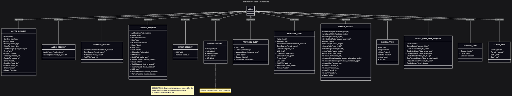
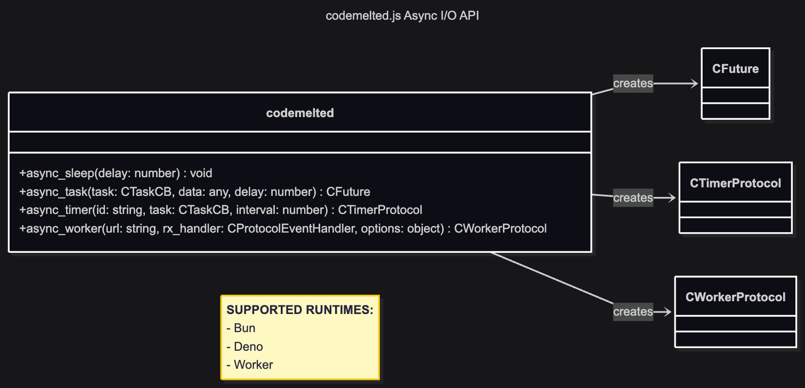

<center>
  <br /><br />
</center>
<h1> codemelted.js Module</h1>

The `codemelted.js` module is an ES6 module that mirrors the `codemelted.rs` module. It's goal is to implement the domain use cases wrapping the Web APIs exposed in a browser runtime. This provides the client side single page app (SPA) / progressive web app (PWA) development support utilizing web technologies. By supporting the SPA / PWA client side development, the `codemelted.js` module will also provide WASM bindings to support client side application development in Rust whether a native desktop application or a web hosted client.

TODO: Add more words about client binding for Rust.

<center>
  <br />
  <a href="https://www.buymeacoffee.com/codemelted" target="_blank">
    
  </a>
  <br /><br />
  <p>If you find this module useful, any support is greatly appreciated. Thank you! 🙇</p>
</center>

**Table of Contents**

- [FEATURES](#features)
- [GETTING STARTED](#getting-started)
  - [Importing](#importing)
  - [URLs](#urls)
- [USAGE](#usage)
  - [Module Support](#module-support)
    - [Faked Types](#faked-types)
  - [Domain Use Cases](#domain-use-cases)
    - [Async I/O](#async-io)
    - [Console](#console)
    - [Database](#database)
    - [Disk](#disk)
    - [Hardware](#hardware)
    - [JSON](#json)
    - [Logger](#logger)
    - [Monitor](#monitor)
    - [Network](#network)
    - [Numeric Processing Unit (NPU)](#numeric-processing-unit-npu)
    - [Process](#process)
    - [Runtime](#runtime)
    - [Storage](#storage)
    - [User Interface](#user-interface)
  - [Rust Binding](#rust-binding)

## FEATURES

 <table style="width: 100%;">
  <tr>
    <td style="width: 275px;">
      
    </td>
    <td>
      <ul>
        <li> Implements the identified domain use cases as a series of exported functions. </li>
        <li> Function names match that of the <code>codemelted.rs</code> rust function names. </li>
        <li> Function parameters / returns are abstracted from JS runtime specific objects. </li>
        <li> This provides for the support of multiple JS runtimes. </li>
        <li> This provides support for TypeScript development / checking. </li>
      </ul>
    </td>
  </tr>
   <tr>
    <td style="width: 275px;">
      
    </td>
    <td>
      <ul>
        <li> The <code>codemelted.js</code> module is ran through the targeted runtime tests. </li>
        <li> When all tests PASS, the <code>codemelted.rs</code> WASM build occurs. </li>
        <li> When the cargo doc, build, and tests all PASS you end up with two build targets. </li>
        <li> The ability to write a pure rust desktop / web app via the <code>codemelted.rs</code> crate. </li>
        <li> The ability to write a JS / TS frontend / backend regardless frontend development framework. </li>
      </ul>
    </td>
  </tr>
 </table>

## GETTING STARTED

### Importing

**Via ES6 Module Import**

```js
// Import whole module statically via URL or local path
import * as codemelted from "path/to/codemelted.js";

// Import elements to use statically via URL or local path
import { exported_element } from "path/to/codemelted.js";

// Dynamically import all module elements to named variable
let codemelted = await import("path/to/codemelted.js");
```

**Via Script**

```html
<script type="module">
  // Use the import examples above to utilize the script functions.
</script>
```

### URLs

- **Latest Version (Risky):** `https://cdn.jsdelivr.net/gh/codemelted/codemelted.rs/js/codemelted.js`
- **Version Controlled (Safest):** `https://cdn.jsdelivr.net/gh/codemelted/codemelted.rs@X.Y.Z/js/codemelted.js`

## USAGE

The following section breaks down each Domain Use Case  implementation details from the main *codemelted.rs Project* design. It also identifies what module exported functions are V8 runtime. All exported functions are available within a browser runtime with varying feature support given the different browsers (i.e. Chromium / Firefox / Safari).

### Module Support

This section documents the common module objects that support the exported functions.

#### Faked Types

In order to preserve the ability to utilize TypeScript within the different V8 runtimes, certain Web APIs were documented as types via jsdoc. These types do not need to be imported from the `codemelted.js` module. They simply exist in order to make the `tsc` happy when importing the module.

**Types:**

- DeviceOrientationEvent
- GeolocationCoordinates
- SerialPort

#### Enumerations

<mark>Write something</mark>



### Domain Use Cases

#### Async I/O



#### Console

Not Applicable.

#### Database

#### Disk

#### Hardware

#### JSON

#### Logger

#### Monitor

#### Network

#### Numeric Processing Unit (NPU)

Not Applicable.

#### Process

Not Applicable.

#### Runtime

#### Storage

#### User Interface

### Rust Binding

<mark>TO BE DEVELOPED</mark>