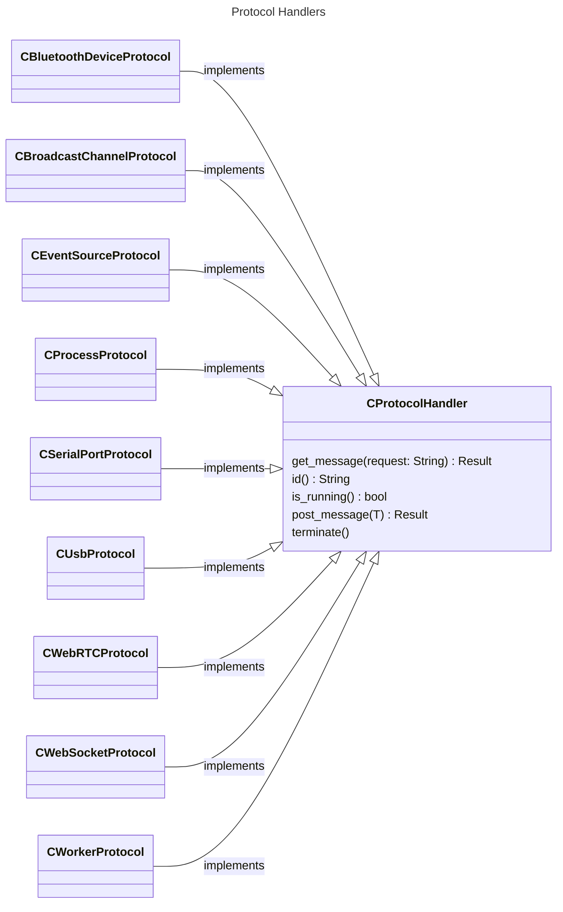

# 1.0 Functional Decomposition

<center></center>

**Table of Contents**

- [1.0 Functional Decomposition](#10-functional-decomposition)
  - [1.1 Model Breakdown](#11-model-breakdown)
  - [1.1.1 Domain Use Cases](#111-domain-use-cases)
    - [1.1.2 Build Targets](#112-build-targets)
  - [1.2 Why Rust?](#12-why-rust)
  - [1.3 General Design Notes](#13-general-design-notes)
    - [1.3.1 Protocol Handlers](#131-protocol-handlers)
    - [1.3.2 Module Organization](#132-module-organization)
    - [1.3.3 Module Versioning](#133-module-versioning)
    - [1.3.4 Error Handling](#134-error-handling)

## 1.1 Model Breakdown

## 1.1.1 Domain Use Cases

1. **Async:** Asynchronous processing both on a main thread, via background threads, repeating timers, and a dedicated worker provides a software engineer the ability to schedule work in a way to run more then one task efficiently.
2. **Console:** Provides a set of STDIN / STDOUT functionality to build an interactive terminal application without a dedicated UI.
3. **DB:** Provides the mechanism for building out an embedded database solution specific to the chosen SDK environment for the language to store complex data structures.
4. **Disk:** Provides the functionality to work with and manage files on internal / external storage.
5. **HW:** Provides the mechanisms to interact with hardware peripherals via Bluetooth, RS-232 serial ports, and USB connected to a system.
6. **JSON:** JSON is the most common data format to work with for web technologies. This will provide all the mechanisms necessary to work with this data.
7. **Logger:** Provides a simple logging facility to STDOUT along with a log handler callback capability for further processing in production.
8. **Monitor:** Running a dedicated application or service necessitates the ability to monitor the host operating environment. This will establish those monitoring capabilities.
9. **Network:** The internet is how apps communicate. This will provide access to web technologies to facilitate this communication.
10. **NPU:**  Stands for Numeric Processing Unit, this will be where all the math is at. Applications need to crunch numbers. This will provide that functionality.
11. **Process:** Provides the interface to interact with host operating system programs as one-off / bi-directional dedicated processes.
12. **Runtime:** Provides the ability to query common properties of the host operating system along with SDK specific hookups for the given runtime.
13. **Storage:** Provides the ability to store data in key / value pairs of strings.
14. **UI:** Identifies the items necessary for the SDK to build either a Graphical User Interface (GUI) or a Terminal User Interface (TUI) to interact with users and provide media capabilities (audio, gaming, video, etc). This establishes UI design goals but is highly tailored to the SDK.

### 1.1.2 Build Targets

- **Command Line Interface (CLI):** The `codemelted` CLI will be an installable program to facilitate actions on an operating system via the terminal. It is developed as part of the `codemelted.rs` module to support the overall codemelted crate actions and to support terminal scripting capabilities.
- **Native App / Service:** The codemelted crate will provide functions that implement the domain use case in its simplest form allowing software engineers the ability to design whatever native app or service they need. A software engineer can also build desktop / mobile applications utilizing the the [TAURI crate](https://v2.tauri.app/) in combination with the `codemelted.js` module rust binding.
- **WebAssembly (WASM):** With the `codemelted.rs` module utilizing bindings of the `codemelted.js` module, full web-stack solutions can be built with Rust and utilized in multiple JavaScript runtimes (Bun / Deno / NodeJS / Web) as a WASM compiled module.

## 1.2 Why Rust?

The `codemelted.rs` module will be an installable crate that provides the full native speed of a C/C++ application but with modern language constructs and memory safety. While C/C++ still has its place in application development, memory safety proves to be the #1 attack vector of hackers. Rust was designed to address those shortcomings and is an ideal choice to eliminate that attack vector. It also provides modern tooling for fully documenting your end product.

The combination of all these targets provides a software engineer a singular solution for the entire full stack. From Internet of Things (IoT), applications / services, and PWAs, everything a software engineer needs in one swiss army knife solution 🙂.

## 1.3 General Design Notes

### 1.3.1 Protocol Handlers



The above diagram reflects the basic construct for how protocols will be implemented within `codemelted` crate. The `post_message() Result` will signal success or error captured when attempting to communicate with the given protocol.The `get_message(request: String) Result` will retrieve either data or any encountered errors with a given protocol. The `is_running() bool` will reflect whether the protocol is still running or has been terminated.

Lastly the `terminate()` will close and cleanup any protocol forcing the creation of a new protocol object. These objects will open / connect upon creation via a `codemelted` crate function. The `get_message() / post_message()` will serve not only as a communication / retrieval of data but also as a command and control for a given protocol.

*NOTE: The `codemelted.js` module will follow this design pattern as well but will adapt where necessary for the JavaScript language.*

### 1.3.2 Module Organization

The `codemelted.rs` module and `codemelted.js` modules will be singular files that implement the identified domain use cases. They will be separated into major section blocks as shown below.

```
// ==================================================
// [ID] =============================================
// ==================================================
```

Function names will identify the domain use case followed by the action being taken. So for instance `logger_log()` is the logger use case logging function. Finally the naming conventions of functions, variables, and classes will follow the naming conventions of the Rust language. That means `snake_case` for functions and parameters and CamelCase for struct / object names.

*NOTE: Enums will follow CamelCase for `codemelted.rs` while the `codemelted.js` module will utilize ALL_CAPS.*

### 1.3.3 Module Versioning

The versioning of modules will be captured via the languages SDK versioning method. It will utilize a modified semantic versioning `X.Y.Z` with the following rules for the numbering scheme for the module.

- **X:** Year of release. Each new year resets the `Y.Z` values to `0`
- **Y:** Breaking change to one of the use case functions or upgrade of dependencies requiring considerations within an app. A change in this value resets `.Z` to `0`.
- **Z:** Bug fix, new use case function implemented, or expansion of a use case function. Continuously updated by adding one with each new release unless reset by `X.Y` changes.

### 1.3.4 Error Handling

Failed use case functions will result in failure state via a `Result` object construct. Any violation of the module use case function API will result in either a `panic!` when it comes to `codemelted.rs` or thrown `SyntaxError` for `codemelted.js` indicating what was violated.

*NOTE: The `codemelted.js` will implement a Result type object construct.*