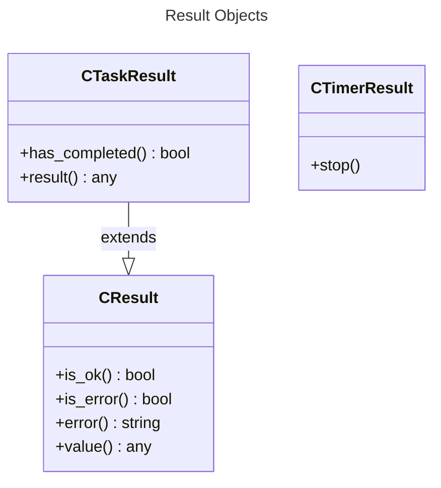
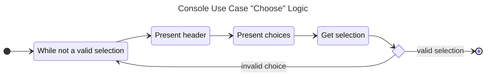
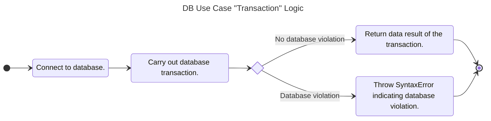
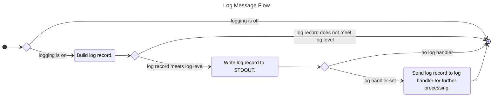
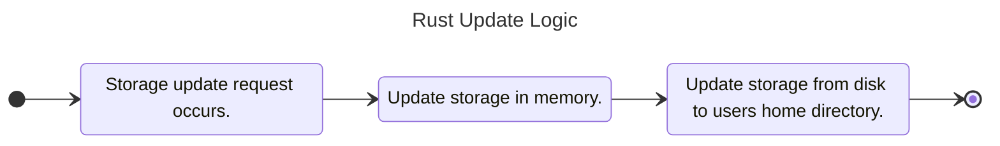

# 2.0 Domain Use Cases

## 2.1 Async Use Case

According to Wikipedia

> a thread of execution is the smallest sequence of programmed instructions that can be managed independently by a scheduler, which is typically a part of the operating system. In many cases, a thread is a component of a process.

What this is stating is that two sets of synchronous execution can occur in parallel. This can be accomplished in two forms with many programming languages, a supported thread constructs for the given language or communicating with other operating system processes (typically another program / service).

According to MDN,

> Asynchronous software design expands upon the concept by building code that allows a program to ask that a task be performed alongside the original task (or tasks), without stopping to wait for the task to complete. When the secondary task is completed, the original task is notified using an agreed-upon mechanism so that it knows the work is done, and that the result, if any, is available.

This basically means the ability to not run code in parallel but instead time slice a main thread to run different tasks where the notification on one task completing kicks off another work task. The *Async Use Case* will implement both concepts playing to the overall strengths of each programming language SDK.

### 2.1.1 Acceptance Criteria

1. The *Async Use Case* will support the ability to sleep a given task in milliseconds.
2. The *Async Use Case* will support the scheduling of a task that can take data (if required) and run to completion returning a result (if required).
3. The *Async Use Case* will support the starting of a timer that repeats a specified task on a regular interval until stopped.
4. The *Async Use Case* will support the ability to start a background worker that has the ability to queue up work tasks in a first in first out (FIFO) order and receive the results of the completed tasks. The returned object will be a Protocol Handler object.

### 2.1.2 Design Notes

## 2.2 Console Use Case

The console as described by Microsoft,

> is an operating system window where users interact with the operating system or with a text-based console application by entering text input through the computer keyboard, and by reading text output from the computer terminal.

Mainly it represents a user interacting with a console application via a terminal shell. Once executing the console-based application, the user will be prompted / informed via STDOUT and enter data via keyboard STDIN. Closure of the console application is either via prompt or a `<ctrl> c` keystroke.

*NOTE: In this context, the console application is an interactive application via STDIN / STDOUT. It is not a dedicated Textual User Interface (TUI) or a shell command where the interaction while still via the terminal shell, is kicked off with arguments passed, and completes its work bringing the user back to the shell prompt.*

### 2.2.1 Acceptance Criteria

1. The *Console Use Case* will support an "Alert" feature that writes a custom message to STDOUT and waits for a user to press the "ENTER" via STDIN before continuing.
2. The *Console Use Case* will support a "Confirm" feature that writes a custom message to STDOUT and wait for a user to answer a `[y/N]` prompt via STDIN before continuing. The return will be a Boolean true for any truthy confirmation.
3. The Console Use Case will support a "Choose" feature that presents an array of choices to STDOUT and waits for a user to select that choice via STDIN before continuing. The return will be an int representing the selected index. Invalid selections will re-prompt the choices for selection until a valid choice is made.
4. The *Console Use Case* will support a "Password" feature that writes a custom message to STDOUT and waits for a user to enter their password via STDIN reflecting none of the typed characters. The return will be a String of the entered password.
5. The *Console Use Case* will support a "Prompt" feature that writes a custom message to STDOUT and waits for a user to enter prompt via STDIN reflecting the typed characters. The return will be a String of the entered prompt.
6. The *Console Use Case* will support a "Write" feature that will write data to STDOUT without a newline character. Every call to this will continue to write data to STDOUT on the same line.
7. The *Console Use Case* will support a "WriteLn" feature that will write data to STDOUT with a newline character.

### 2.2.2 Design Notes

## 2.3 DB Use Case

According to Wikipedia,

> In computing, a database is an organized collection of data or a type of data store based on the use of a database management system (DBMS), the software that interacts with end users, applications, and the database itself to capture and analyze the data. The DBMS additionally encompasses the core facilities provided to administer the database. The sum total of the database, the DBMS and the associated applications can be referred to as a database system. Often the term "database" is also used loosely to refer to any of the DBMS, the database system or an application associated with the database.

For this particular use case, the organized collection will be segmented into two types of databases. The first is a relational embedded database via SQLite for Rust and V8 runtimes (i.e. Deno / NodeJS). The seconds is an indexed database (i.e. no SQL) via the Web Browser APIs.

### 2.3.1 Acceptance Criteria

1. The *DB Use Case* will support a manage feature to allow for altering the structure of the database. A true / false will be returned to indicate success or failure.
2. The *DB Use Case* will support a query feature to allow for getting data from the database. The data will be held in an array like structure tailored for the database technology.
3. The *DB Use Case* will support an update feature to allow for adding / updating / deleting data within the database. An integer will be returned indicating how many records within the database were updated.
4. Any failure of the transactions above will result in a thrown `SyntaxError` error as it will be a violation of database rules.

### 2.3.2 Design Notes

*Local DB Instances*

- *Browser Runtime (JS Web):* Will utilize IndexDB NoSQL database available in web browsers.
- *V8 Runtime (Deno / NodeJS):* Will utilize sqlite3 embedded database.
- *Rust (Native Compiled):* Will utilize sqlite3 embedded database.

## 2.4 Disk Use Case

Regardless of where you run your application you will need the ability to store data. The host operating system provides access to be able to manage such files. The Disk Use Case will provide the ability to read / write file content to disk. It will also support the ability to manage these files on disk allowing for the creation of files, deletion of files, the ability to rename the files, and to delete such files.

### 2.4.1 Acceptance Criteria

1. The *Disk Use Case* will support the reading of an entire file from the hosted operating system disk. This will be read either as a string or a binary blob.
2. The *Disk Use Case* will support writing an entire file to disk from either a String or binary Blob. This will support either creation of a file or appending to an existing file.
3. The *Disk Use Case* will support copy files / directories from one location to another on the hosted operating system disk.
4. The *Disk Use Case* will support detecting whether a file or directory exists on the hosted operating system disk.
5. The *Disk Use Case* will support listing of files / directories on the hosted system disk.
6. The *Disk Use Case* will support the ability to monitor all attached disks to the host operating system.
7. The *Disk Use Case* will support creation of directories on the hosted system disk.
8. The *Disk Use Case* will support moving files / directories from one location to another on the hosted operating system disk.
9. The *Disk Use Case* will support removing files / directories from the hosted operating system disk.
10. The *Disk Use Case* will support getting the size of files / directories from the hosted operating system disk.
11. Failures of any of the above transactions will be indicating either by a Boolean true / false or a null for the given requested data.

### 2.4.2 Design Notes

None.

## 2.5 HW Use Case

According to Wikipedia for the hardware of interest.

> Bluetooth Low Energy (Bluetooth LE, colloquially BLE, formerly marketed as Bluetooth Smart) is a wireless personal area network technology designed and marketed by the Bluetooth Special Interest Group (Bluetooth SIG) aimed at novel applications in the healthcare, fitness, beacons, security, and home entertainment industries. Compared to Classic Bluetooth, Bluetooth Low Energy is intended to provide considerably reduced power consumption and cost while maintaining a similar communication range.

> A serial port is a serial communication interface through which information transfers in or out sequentially one bit at a time. This is in contrast to a parallel port, which communicates multiple bits simultaneously in parallel. Throughout most of the history of personal computers, data has been transferred through serial ports to devices such as modems, terminals, various peripherals, and directly between computers.

> Universal Serial Bus (USB) is an industry standard, developed by USB Implementers Forum (USB-IF), for digital data transmission and power delivery between many types of electronics. It specifies the architecture, in particular the physical interfaces, and communication protocols to and from hosts, such as personal computers, to and from peripheral devices, e.g. displays, keyboards, and mass storage devices, and to and from intermediate hubs, which multiply the number of a host's ports.

The *HW Use Case* will support these different hardware types. Each of them is similar in terms of how you interact with them. You must first scan for devices connected to the host operating system. Once you identify the hardware you want, you connect to it. Once connected, you are able to read / write data with the hardware until you close the connection. This use case will facilitate this transactions.

### 2.5.1 Acceptance Criteria

1. The *HW Use Case* will provide the ability to scan for connected hardware devices based on the hardware type. The result will be a list of connected devices one can open a connection.
2. The *HW Use Case* will provide the ability to open a connection to a hardware device. The result will be a Protocol Handler to facilitate reading and writing data to the hardware until disconnected. Failed connections will result in a NULL return.
3. The *HW Use Case* will provide the ability to attach event listeners to the browser based global events and individual object events.
4. The *HW Use Case* will provide the ability to query the current device location and orientation in 3D space.

### 2.5.2 Design Notes

This domain use case will not apply to the `codemelted.js` module.

## 2.6 JSON Use Case

According to Wikipedia,
> "JSON (JavaScript Object Notation) is an open standard file format and data interchange format that uses human-readable text to store and transmit data objects consisting of name–value pairs and arrays (or other serializable values). It is a commonly used data format with diverse uses in electronic data interchange, including that of web applications with servers. JSON is a language-independent data format. It was derived from JavaScript, but many modern programming languages include code to generate and parse JSON-format data. JSON filenames use the extension .json.

The *JSON Use Case* will provide the functions necessary to facilitate working with the JSON format. This includes data validation, translating between supported data types, creating the SDK language JSON compliant format, parsing of strings to JSON, and stringifying the JSON object to a serialized JSON string.

### 2.6.1 Acceptance Criteria

1. The *JSON Use Case* will support the translation of Strings to the appropriate JSON data types. Failure to perform such a translation will result in a NULL (whatever that means in the given SDK language).
2. The *JSON Use Case* will support the checking of variable data types to ensure that dynamic type data is as expected. This will support Boolean true / false returns along with the ability to throw an exception.
3. The *JSON Use Case* will support the creation on JSON compliant arrays and objects to support later JSON stringifying.
4. The *JSON Use Case* will support the ability to check a JSON object containing expected keys. This will support Boolean true / false returns along with the ability to throw an exception.
5. The *JSON Use Case* will support the parsing of a JSON string into a JSON compliant object. Failure to perform the parse will result in a NULL (whatever that means in the given SDK language).
6. The *JSON Use Case* will support the stringifying of a JSON compliant object to produce a JSON serialized string. Failure to perform the parse will result in a NULL (whatever that means in the given SDK language).
7. The *JSON Use Case* will support the validation of URL strings. This will support Boolean true / false returns along with the ability to throw an exception.

### 2.6.2 Design Notes

None.

## 2.7 Logger Use Case

The most tried and true method of performing application diagnostics is logging. While Integrated Development Environments (IDEs) provide many tools to aid in development, logging captures what is happening within your application when a bug arises. And at the end of the day, bugs will always occur. To that end, the *Logger Use Case* represents a simple logging facility to STDOUT supporting four log levels.

The four log levels are DEBUG, INFO, WARNING, and ERROR. The STDOUT logging can aid while the application is being developed. Additionally, the *Logger Use Case* will provide a logged event handler that allows expanding on this logging facility to attach other processing. This can be as simple as logging to file to logging events to log server. You can decide.

### 2.7.1 Acceptance Criteria

1. The *Logger Use Case* will provide the ability to log to STDOUT supporting the logging levels of DEBUG, INFO, WARNING, and ERROR. The log format will be `TIMESTAMP [LEVEL]: MESSAGE`.
2. The *Logger Use Case* will support the setting of the given log level where logged events that don't meet that log level are not processed. It will also provide the ability to turn off the logging altogether.
3. The *Logger Use Case* will support the attaching of a Logged Event Handler to process logged events once they are logged to STDOUT.

### 2.7.2 Design Notes

## 2.8 Monitor Use Case

The ability to measure aspects of the host computer / operating system of a developed application is key in identifying metrics that can point to issues with the host system. The *Monitor Use Case* identifies the different areas of a host system typically measured and analyzed to identify potential problem areas or areas for improvement.

### 2.8.1 Acceptance Criteria

1. The *Monitor Use Case* will provide the ability to measure attached hardware components reporting their current temperature in Celsius, its max temperature, and critical failure temperature.
2. The *Monitor Use Case* will provide the ability to report on attached disks to the host operating system reporting the name, available bytes, used bytes, total bytes, load percentage, file system, is it read only, what kind, and mount point.
3. The *Monitor Use Case* will provide the ability to report on the network of the host operating system identifying names, mac address, mtu, total received / transmitted bytes, total received / transmitted errors, and total received / transmitted packets.
4. The *Monitor Use Case* will provide the ability to measure the host computers overall performance via CPU load (as measured across all CPUs), available RAM in bytes, free RAM in bytes, used RAM in bytes, total RAM in bytes, total RAM load percentage, SWAP free bytes, SWAP used bytes, SWAP total bytes, and the SWAP load percentage.
5. The *Monitor Use Case* will provide the ability to measure the currently running host operating system processes identifying each process by PID, CPU load percentage, current working directory, total read bytes from disk, total written bytes to disk, the executable path, group id, RAM usage in bytes, RAM virtual usage in bytes, name of the process, how many open files, any parent PID, path root directory, session id, status of the running process, time started in seconds, time running in seconds, and the user id of the process. It will also provide the ability to kill and wait for process completion.
6. Each of the monitoring capabilities above will provide the ability to save the monitored data into a textual based format and run in the background as setup by the software engineer.

### 2.8.2 Design Notes

None.

## 2.9 Network Use Case

According to Cloudflare,

> "the open systems interconnection (OSI) model is a conceptual model created by the International Organization for Standardization which enables diverse communication systems to communicate using standard protocols. In plain English, the OSI provides a standard for different computer systems to be able to communicate with each other. The OSI Model can be seen as a universal language for computer networking. It is based on the concept of splitting up a communication system into seven abstract layers, each one stacked upon the last.

  

The *Network Use Case* will facilitate several protocols that fit this model.This will be network protocols to communicate with servers or amongst other web apps for the frontend. For the backend, it will be to support the server side protocols for the client-side network protocols to connect.

### 2.9.1 Acceptance Criteria

1. The *Network Use Case* will support the ability to fetch data from RESTful APIs. The response will include http status code, status text, and the particular data received with the ability to translate between it.
2. The *Network Use Case* will support the ability to broadcast messages between web apps and services.
3. The Network Use Case will support the client network protocols of Server Sent Events, Web Sockets, and WebRTC.
4. The *Network Use Case* will support the ability to act as a server for the network protocols of HTTP and Web Sockets and Web RTC.

### 2.9.2 Design Notes

None.

## 2.10 NPU Use Case

According to Wikipedia,

> A floating-point unit (FPU), numeric processing unit (NPU), colloquially math coprocessor, is a part of a computer system specially designed to carry out operations on floating-point numbers. Typical operations are addition, subtraction, multiplication, division, and square root.

The *NPU Use Case* will build upon this idea by setting up a collection of mathematical formulas for execution. These will range the gambit of typical formulas a developer may encounter. Furthermore, a compute capability will also exist to carry out complicated computations that involve more than a standard mathematical formula.

### 2.10.1 Acceptance Criteria

1. The *NPU Use Case* will support the execution of mathematical formulas by providing a selection of said formula and passing the arguments necessary to complete the calculation. Mismatched arguments will result in an exception. Failed calculations (i.e. square of negative number, etc.) will result in a NAN return.
2. The *NPU Use Case* will support the ability to compute (i.e. series of computations) and return the result. The communication method of this capability will be JSON compliant data for both the request and result of the run. Unknown requests will be handled as an exception.

### 2.10.2 Design Notes

None.

## 2.11 Process Use Case

According to Wikipedia,

> In computing, a process is the instance of a computer program that is being executed by one or many threads. There are many different process models, some of which are light weight, but almost all processes (even entire virtual machines) are rooted in an operating system (OS) process which comprises the program code, assigned system resources, physical and logical access permissions, and data structures to initiate, control and coordinate execution activity. Depending on the OS, a process may be made up of multiple threads of execution that execute instructions concurrently.

This use case will facilitate the functionality to detect installed programs, run one off command to gather outputs, and setup a bi-directional STDIN / STDOUT dedicated process your program can communicate.

### 2.11.1 Acceptance Criteria

1. The *Process Use Case* will support the ability to detect if a command exists with the host operating system.
2. The *Process Use Case* will support the ability to run a one-off command and capture its STDOUT / STDERR output.
3. The *Process Use Case* will support the ability to run a bi-directional command that is communicated with via STDIN / STDOUT / STDERR until command to end its processing

### 2.11.2 Design Notes

None.

## 2.12.0 Runtime Use Case

According to Tech Target:

> Runtime is a piece of code that implements portions of a programming language's execution model. In doing this, it allows the program to interact with the computing resources it needs to work. Runtimes are often integral parts of the programming language and don't need to be installed separately.

> Runtime is also when a program is running. That is, when you start a program running in a computer, it is runtime for that program. In some programming languages, certain reusable programs or "routines" are built and packaged as a "runtime library." These routines can be linked to and used by any program when it is running.

The *Runtime Use Case* will provide queryable actions common between all the runtimes for the chosen languages models. It will then implement SDK specific functions to fully exercise the availability of functionality for a chosen SDK programming language.

### 2.12.1 Acceptance Criteria

1. The *Runtime Use Case* will provide the following queryable actions. Failed queryable values will result in a minimum value or UNDETERMINED if a String return:
   1. CPU architecture
   2. Number of CPUs
   3. Environment variables
   4. User's home directory
   5. Hostname
   6. Kernel version
   7. Online access to the Internet
   8. OS name
   9. OS version
   10. Path separator
   11. Temp path
   12. User name
2. The *Runtime Use Case* will provide access to SDK language specific features not common between the chosen module languages. (i.e. Event attachment in JavaScript, etc.).

### 2.12.2 Design Notes

None.

## 2.13.0 Storage Use Case

The *Storage Use Case* will provide a mechanism similar to the *Web Storage API*. This is a simple string key / value pair storage mechanism. Developers will have the ability to set, get, and remove items from storage. They will also have the ability to clear the entire mechanism. For the JavaScript web runtime, a developer will have the option to not only utilize local (long term storage) but session and cookies as storage mechanisms. For Rust, the storage mechanism will mirror that of local storage and facilitate setting these values in memory while saving the storage as a file in the user's HOME directory.

### 2.13.1 Acceptance Criteria

1. The *Storage Use Case* will provide the ability to set a key / value string within storage.
2. The *Storage Use Case* will provide the ability to get a value based on the key from storage. If the key does not exist, then NULL is returned.
3. The *Storage Use Case* will provide the ability to remove a key / value from storage.
4. The *Storage Use Case* will provide the ability to clear all entries from storage.
5. The *Storage Use Case* will provide the ability to identify how many items exist within the storage.

### 2.13.2 Design Notes

*NOTE: The above demonstrates how Rust will match the Web Storage API.*

## 2.14 UI Use Case

The *UI Use Case* is all about bringing a user interface to interact and present data. The modules will strive to deliver a Single Page App (SPA) view regardless of the technology. This will treat the user interface as a divided grid as shown below. The remaining items the *UI Use Case* will provide support the SPA and its transitions.

A dialog feature will provide the ability to alert (a.k.a. snackbar), close, confirm, choose, custom, load, open, and prompt, to get information from a user. This will be asynchronous by nature. The theme feature will aim to give a theme for the overall SPA with the ability to override for an individual widget. The widgets feature will allow for building the different controls and layouts for the SPA. Lastly an audio feature will provide the ability to play sounds and perform text to speech if available for the SDK language.

### 2.14.1 Acceptance Criteria

Not Applicable.

### 2.14.2 Design Notes

