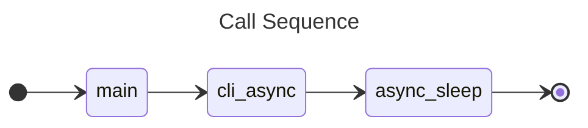
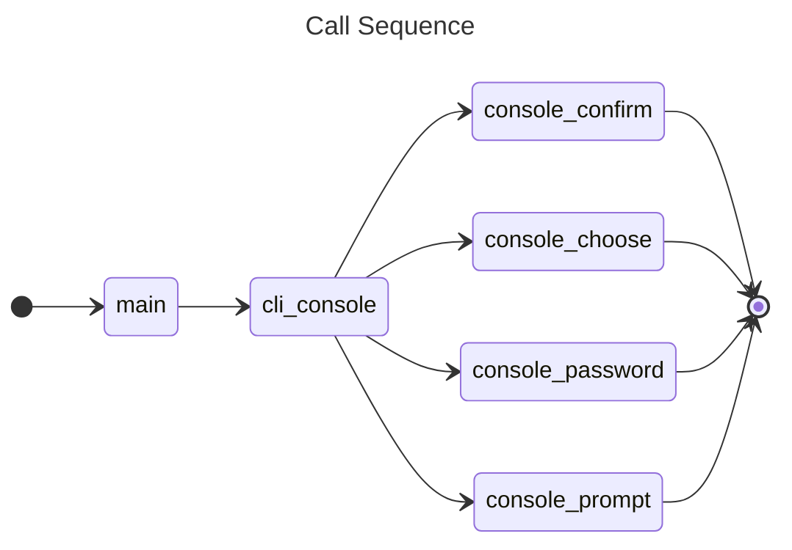
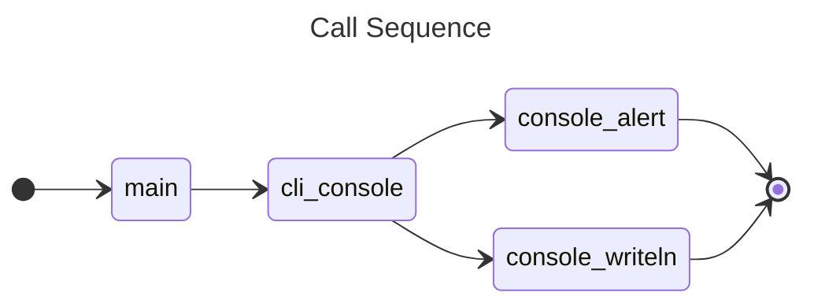

# 3.0 Command Line Interface (CLI)

<table>
<tr>
<td style="width: 275px;"></td>
<td>
<ul>
<li>The CLI is the main interface for operating system terminals.</li>
<li>The <code>codemelted</code> command provides a native CLI command available on any operating system that supports a Rust compiler.</li>
<li>The <code>codemelted</code> command provides will provide common actions between operating systems along with specific toolchains associated with the <code>codemelted.rs</code> project.</li>
<li>The <code>codemelted-cli</code> pwsh Core module is a specialized set of CLI bindings building on top of the <code>codemelted</code> native command but providing the power of PowerShell command / scripting concepts.</li>
<li>Scripting utilizing the <code>codemelted</code> / <code>codemelted-cli</code> environment provide a powerful DevOps toolchain set of automation.</li>
</ul>
</td>
</tr>
</table>

## 3.1 codemelted (native command)

The `codemelted` command is a Rust compiled native CLI program available within the terminal of a given operating system. It's goal is to facilitate common but different actions between operating systems. This means that regardless of the operating system, the action is carried out the same. For instance interacting with STDIN / STDOUT or working with files on disk. This allows for more easily working within the operating system's terminal or native scripting language to facilitate those given actions. It will also provide more complex actions only available via a natively developed command.

### 3.1.1 Installation / Removal

Before being able to install the native `codemelted` command, you must install rust. To do so, follow the [Install Rust](https://rust-lang.org/tools/install/) to install the necessary rust compilers and toolchains. After that, execute the different command below.

- **INSTALL:** `cargo install codemelted`
- **UPGRADE:** `cargo upgrade --package codemelted`
- **UPGRADE ALL:** `cargo upgrade`
- **UNINSTALL:** `cargo uninstall --package codemelted`

*NOTE: The above will be installed via the [3.2 codemelted-cli (pwsh Core Module)](#32-codemelted-cli-pwsh-core-module) if utilizing the pwsh Core terminal.*

### 3.1.2 Commands

To access the help system after installation execute `codemelted --help`.

```
================================================================
codemelted (CLI Native Command)
================================================================

SYNTAX: codemelted [action] [params]

USAGE:
  --async-sleep [delay_in_milliseconds]
      Will sleep for the specified milliseconds. Invalid entries
      will sleep for 0 ms.
  --console-alert [message]
      Pauses execution while reporting a message.
  --console-confirm [message]
      Provides a confirmation prompt via STDOUT with the answer
      being written to STDOUT as true / false.
  --console-choose [message] [choices]
      Provides a selection menu of the CSV choices waiting for
      a valid selection from the user with the chosen index
      written to STDOUT.
  --console-password [message]
      Provides a password prompt writing out the password to
      STDOUT.
  --console-prompt [message]
      Provides an input prompt writing out the answer to
      STDOUT.
  --console-writeln [message]
      Writes [message] to STDOUT with a newline.
  --help Prints this help system.

WEBSITE: https://codemelted.com/developer/
  Select section '3. Command Line Interface' of the page.
```

#### 3.1.2.1 --async-* Actions

The only asynchronous action supported by the `codemelted` command is sleeping for a specified number of millisecond. Invalid entries will default to `0` and have no affect.

**Example:**

```
codemelted --async-sleep 200
```

**Design Notes:**



#### 3.1.2.2 --console-* Actions

The console represents interacting with a terminal user via STDIN (keyboard) / STDOUT (terminal output). The following sections break out the STDIN / STDOUT actions.

##### 3.1.2.2.1 STDIN Actions

The following reflect actions to prompt the user for information to be entered in via STDIN and the answer reported via STDOUT. See [3.3 Scripting Language Note](#33-scripting-language-notes) for how to capture that information within a script variable for later processing.

To ask a user for confirmation to a question. Returns to STDOUT are "true" for confirmation and "false" otherwise.

**Example:**

```
% codemelted --console-confirm "Are You Sure"
Are You Sure CONFIRM [y/N]: N
false
% _
```

To ask a user to make a choice selection from a CSV of options. Returns to STDOUT the "index" of the choice.

**Example:**

```
% ./codemelted --console-choose "A Pet" "bird,cat,dog,fish"
-----
A Pet
-----
0. bird
1. cat
2. dog
3. fish

Make a Selection: 2
2
% _
```

To prompt the user to enter in some general information. Entered value reported to STDOUT.

**Example:**

```
% ./codemelted --console-prompt "Login Username"

Login Username: Dave
Dave
% _
```

To request the user for a password that is not reflected while typing. Entered value reported to STDOUT.

**Example:**

```
% ./codemelted --console-password "Login Password"

Login Password:
password
% _
```

**Design Notes:**



##### 3.1.2.2.2 STDOUT Actions

To alert a user with a message and pause execution until the user presses enter.

**Example:**
```
% codemelted --console-alert "It's broken"
It's broken [ENTER]:
% _
```

To write a message to STDOUT without any user interaction.

**Example:**

```
% codemelted --console-writeln "Some information"
Some information
% _
```

**Design Notes:**



## 3.2 codemelted-cli (pwsh Core Module)

<mark>BEING DEVELOPED. SEE GITHUB REPO FOR PROGRESS.</mark>

## 3.3 Scripting Language Notes

<mark>TO BE DETERMINED.</mark>