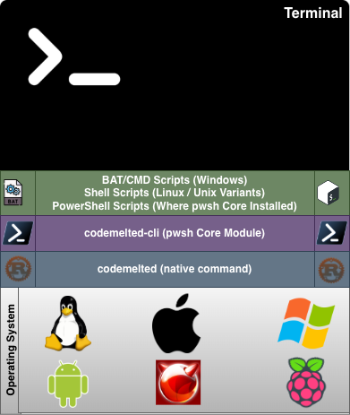
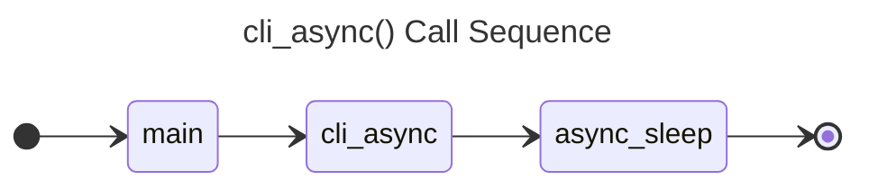
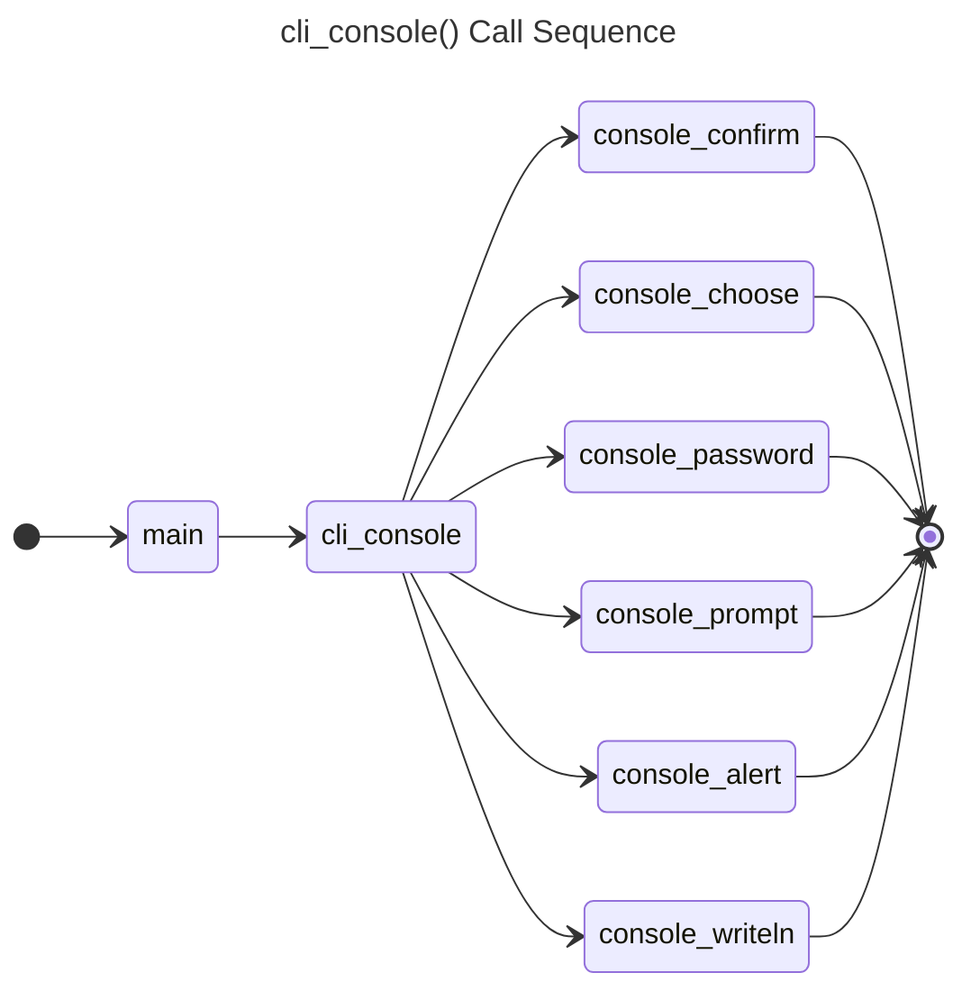
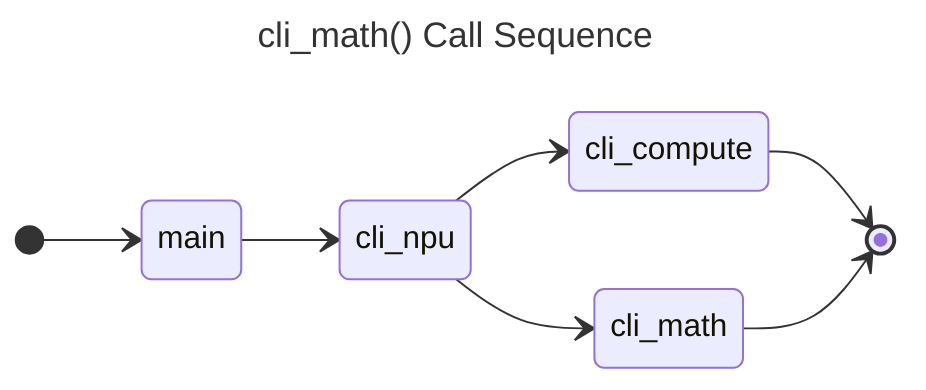

# 3.0 Native Command Line Interface (CLI)

<table>
<tr>
<td style="width: 275px;"></td>
<td>
<ul>
<li>The CLI is the main interface for operating system terminals.</li>
<li>The <code>codemelted</code> command provides a native CLI command available on any operating system that supports a Rust compiler.</li>
<li>The <code>codemelted</code> command provides will provide common actions between operating systems along with specific toolchains associated with the <code>codemelted.rs</code> project.</li>
<li>Starter script files for Mac, Linux, and Windows Operating Systems (OS) will provide preassembled command wrappers and the ability to setup within those OS terminal environments via those starter script files.</li>
</td>
</tr>
</table>

**Table of Contents**

- [3.0 Native Command Line Interface (CLI)](#30-native-command-line-interface-cli)
  - [3.1 codemelted Native CLI](#31-codemelted-native-cli)
    - [3.1.1 Installation / Removal](#311-installation--removal)
    - [3.1.2 Commands](#312-commands)
    - [3.1.3 Shell Scripting Notes](#313-shell-scripting-notes)
      - [3.1.3.1 Linux / Mac / Unix](#3131-linux--mac--unix)
      - [3.1.3.2 Windows](#3132-windows)
  - [3.3 Command Breakdown](#33-command-breakdown)
    - [3.3.1 --async-\* Actions](#331---async--actions)
    - [3.3.2 --console-\* Actions](#332---console--actions)
    - [3.3.3 --npu-\* Actions](#333---npu--actions)

## 3.1 codemelted Native CLI

The `codemelted` command is a Rust compiled native CLI program available within the terminal of a given operating system. It's goal is to facilitate common but different actions between operating systems. This means that regardless of the operating system, the action is carried out the same. For instance interacting with STDIN / STDOUT or working with files on disk. This allows for more easily working within the operating system's terminal or native scripting language to facilitate those given actions. It will also provide more complex actions only available via a natively developed command.

### 3.1.1 Installation / Removal

Before being able to install the native `codemelted` command, you must install rust. To do so, follow the [Install Rust](https://rust-lang.org/tools/install/) to install the necessary rust compilers and toolchains. After that, execute the different command below.

- **INSTALL / UPGRADE:** `cargo install codemelted`
- **UNINSTALL:** `cargo uninstall --package codemelted`

### 3.1.2 Commands

To access the help system after installation execute `codemelted --help`.

```
================================================================
codemelted Native Command - v26.0.0
================================================================

SYNTAX: codemelted [action] [params]

USAGE:
  --async-sleep [delay_in_milliseconds]
      Will sleep for the specified milliseconds. Invalid entries
      will sleep for 0 ms.
  --console-alert [message]
      Pauses execution while reporting a message.
  --console-confirm [message]
      Provides a confirmation prompt via STDOUT with the answer
      being written to STDOUT as true / false.
  --console-choose [message] [choices]
      Provides a selection menu of the CSV choices waiting for
      a valid selection from the user with the chosen index
      written to STDOUT.
  --console-password [message]
      Provides a password prompt writing out the password to
      STDOUT.
  --console-prompt [message]
      Provides an input prompt writing out the answer to
      STDOUT.
  --console-writeln [message]
      Writes [message] to STDOUT with a newline.
  --npu-math [formula] [arguments]
      Writes the answer to the calculated formula w/ arguments.
  --help Prints this help system.

WEBSITE: https://rs.codemelted.com/
```

### 3.1.3 Shell Scripting Notes

The following sections breakdown the basic structure for writing native terminal scripts for each identified operating system. *NOTE: See <a href="https://rs.codemelted.com/?open=https://rs.codemelted.com/support/gists.html" target="_top">CodeMelted GISTS</a> for an update to starter script with the wrapper of the codemelted native CLI.*

#### 3.1.3.1 Linux / Mac / Unix

```sh
#!/usr/bin/env bash
# =============================================================================
# PUT COMMENTS ABOUT THE SCRIPT
# =============================================================================
function main {
  # You can also break up the script with more functions making it very
  # versatile for writing complex BASH scripts for you UNIX / LINUX system.
  function sub_task {
    # See sub_task
  }

  # ---------------------------------------------------------------------------
  # [MAIN] --------------------------------------------------------------------
  # ---------------------------------------------------------------------------
  $action = $1
  if [ "$action" == "help" ]; then
    # Do something with the action.
    sub_task
  fi
}
main $@
```

#### 3.1.3.2 Windows

<mark>TBD</mark>

```bat
:: TBD
```

## 3.3 Command Breakdown

### 3.3.1 --async-* Actions

The only asynchronous action supported by the `codemelted` command is sleeping for a specified number of millisecond. Invalid entries will default to `0` and have no affect.

`--async-sleep 200` : Will synchronously pause script execution for 200 milliseconds.

**Design Notes:**



### 3.3.2 --console-* Actions

The console represents interacting with a terminal user via STDIN (keyboard) / STDOUT (terminal output). The following further breaks down those supported actions.

`--console-confirm "Are You Sure"` : Prompts a `Are You Sure CONFIRM [y/N]:` to STDOUT. Answering `Y` will result in a `true` string STDOUT message. Any other value will result in a `false` string STDOUT message.

`--console-choose "A Pet" "bird,cat,dog,fish"` : Produces a selection as shown below writing the selected index number as a string to STDOUT. Invalid selections will prompt to try again.
```
-----
A Pet
-----
1. bird
2. cat
3. dog
4. fish

Make a Selection:
```

`--console-prompt "Login Username"` : Prompts the user to enter in some general information. Entered value reported to STDOUT.

`--console-password "Login Password"` : Prompts the user for a password where the typed answer will not be reflected as typed. Entered value reported to STDOUT.

`--console-alert "It's broken"` : Prompts an alert to STDOUT paused until the user presses ENTER.

`--console-writeln "Some information"` : Writes a message to STDOUT with a newline.

**Design Notes:**



### 3.3.3 --npu-* Actions

To calculate an answer to a computational series or mathematical formula by specifying its arguments. The answer is then written to STDOUT.

<mark> --npu-compute TBD</mark>

`--npu-math TemperatureCelsiusToFahrenheit 0.0` : Specify the mathematical formula to execute an the arguments that are part of that formula's calculation

*NOTE: See "4.0 Numeric Processing Unit (NPU)" for details of all the supported formulas and compute options.*

**Design Notes:**


